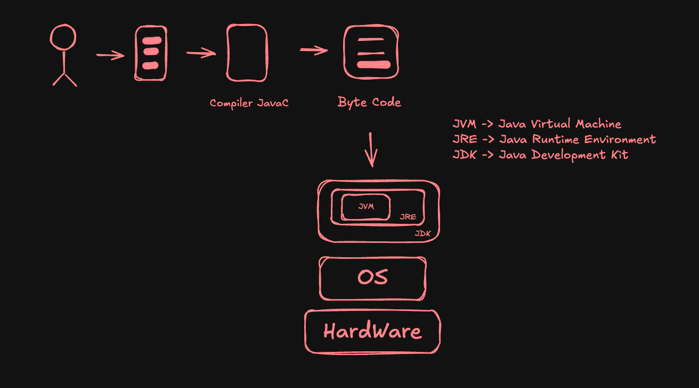

# Java Spring Framework 6 with Spring Boot 3

### Source Code Links
* Java Source Code: https://github.com/navinreddy20/Javacode
* Spring Source Code: https://github.com/navinreddy20/spring6-course
* Microservices Source Code: https://github.com/navinreddy20/MicroserviceTutorials

### Core Java
#### JDK Setup
* IDE (Integrated Development Environment): VS Code, Eclipse, IntelliJ Idea, NetBeans
* Compiler
* JDK (Java Development Kit)
* JDK Download: https://www.oracle.com/java/technologies/downloads/#jdk24-mac
* Check java & javac version
```
$ java --version
$ javac --version
```
* Download VS Code: https://code.visualstudio.com/download

#### IntelliJ Idea Setup
* Download IntelliJ Idea: https://www.jetbrains.com/idea/

#### First Code in Java
* JShell (Java Shell Tool)
* Entering JShell, write jshell in terminal
```
$ jshell
$ 2 + 3
$ System.out.println("Hello World");
```
* Java Code
```
public class Main {
    public static void main(String[] args) {
        System.out.println("Hello World!");
    }
}
```

* Compile Java Code: `$javac filename.java`

#### How Java Works


### Variables
* Java is Strongly Typed Language
```
public class Main {
    public static void main(String args[]) {
        int num1 = 5;
        int num2 = 3;
        int result = num1 + num2;
        System.out.println(result);
    }
}
```
* Data Type -> Primitive Type
    -> Integer -> int(4bytes), long(8bytes), short(2bytes), byte(1byte)
    -> Float -> float(4bytes), double(8bytes)
    -> Character -> char(2bytes)
    -> Boolean -> True/False
```
public class Main {
    public static void main(String args[]) {
        int num1 = 9;
        byte by = 127;
        short sh = 558;
        long l = 5854l;
        float f = 5.8f;
        double d = 5.8;
        char c = 'k';
        boolean b = true;
    }
}
```

### Literals
Literals are the fixed values that write directly into code. They represent constant values of a particular data type - like numbers, characters, strings etc.
```
int number = 100;            // Integer literal
float pi = 3.14f;            // Floating-point literal
char grade = 'A';            // Character literal
String name = "John";        // String literal
boolean isPassed = true;     // Boolean literal
String city = null;          // Null literal
```

### Type Conversion (Automatic/Implicit Casting)
* Java automatically converts a smaller data type into a larger data type
* It happens implicitly 
* No data loss happens here
```
int a =10;
long b = a;
float c = b;
```
* Order of data types (small -> big)
byte -> short -> int -> float -> double

### Type Casting (Manual/Explicit Casting)
* Manually convert a larger data type into a smaller data type
* Have to tell Java what is trying to do
* Risk of data loss if the value is too big
```
double d = 9.78;
int i = (int) d;
```

### Arithmetic Operators
* Addition (+)
* Subtraction (-)
* Multiplication (*)
* Division (/)
* Modulus Operator to get reminder (%)
* +=, -=, *=, /=, %=
* Increment Operator -> i++ (post-increment), ++i (pre-increment)
* Decrement Operator -> i-- (post-decrement), --i (pre-decrement)

### Relational Operators
* >, <, >=, <=, ==, !=

### Logical Operator
* &&, ||, !

### If Else
```
if(condition) {
    statement;
} else {
    statement;
}
```

### If Else If
```
if(condition1) {
    statement;
} else if (condition2) {
    statement;
} else {
    statement;
}
```

### Ternary
```
condition ? statement1 : statement2;

number i = n % 2 == 0 ? 10 : 15;
```

### Switch Statement
```
public class Main {
    public static void main(String args[]) {
        int n = 2;

        switch(n) {
            case 1:
                System.out.println("One");
                break;
            case 2:
                System.out.println("Two");
                break;
            default:
                System.out.println("Default"); 
        }
    }
}
```

### While Loop
```
public class Main {
    public static void main(String args[]) {
        int i = 1;

        while(i <= 4) {
            System.out.println("Hello " + i);
            i++;
        }
    }
}
```

### Do While Loop
```
public class Main {
    public static void main(String args[]) {
        int i = 1;
        
        do {
            System.out.println("Hello " + i);
        } while(n <= 4);
    }
}
```

### For Loop
```
public class Main {
    public static void main(String args[]) {
        for(int i = 0; i <= 4; i++) {
            System.out.println("Hello " + i);
        }
    }
}
```

### Class and Object theory
* Object Oriented Programming
* Object - Properties and Behavior
* Class
* Create a class file -> Compiled to create a byte code -> JVM run this byte code and object is created

### Class and Object Practical
```
class Calculator{
    public int add(int num1, int num2){
        int result = num1 + num2;
        return result; 
    }
}

public class Demo {
    public static void main(String a[]) {
        int num1=4; 
        int num2=5;

        Calculator calc = new Calculator();
        int result = calc.add(num1, num2);
        System.out.println(result);
    }
}
```

### JDK, JRE, JVM

* JDK (Java Development Kit) -> Convert the java code into byte code
* JVM (Java Virtual Machine) -> Runs the Java Code
* JRE (Java Runtime Environment) -> Provide the additional in-built classes for running java code

### Methods
```
class Computer {
    public void playMusic() {
        System.out.println("Music Playing...");
    }

    public String getMeAPen(int cost) {
        if(cost >= 10)
            return "Pen";
        
        return "Nothing";
    }
}

public class Demo {
    public static void main(String a[]) {
        Computer comp = new Computer();
        comp.playMusic();
        String str = comp.getMeAPen(12);
        System.out.println(str);        
    }
}
```

### Method Overloading
```
class Calculator {
    public int add(int n1, int2){
        return n1+n2;
    }

    public double add(double n1, int n2){
        return n1+n2;
    }

    public int add(int n1, int n2, int n3){
        return n1+n2+n3;
    }
}

public class Demo {
    public static void main(String a[]) {
        Calculator calc = new Calculator();
        calc.add(2,3);
        calc.add(2,3,4);
    }
}
```

### Stack & Heap
In java, stack & heap are two areas of memory used for different purposes:
Stack:
    * Stores: Local variables, method calls and references to objects
    * Scope: Each thread has it's own stack
    * Lifetime: Variables are created when a method is called and destroyed when the method exits
    * Speed: Very fast access
    * Memory Management: Handled automatically LIFO - Last In First Out
    * Example:

```
    int x = 10;
```

Heap:
    * Stores: All Java Objects (instances created with new)
    * Scope: Shared among all threads
    * Lifetime: Objects remain until they are no longer referenced and garbage collected
    * Speed: Slower than stack
    * Memory management: Managed by java garbage collector
    * Example:
```
Calculator calc = new Calculator();
```

### Creation of Array
```
public class Demo {
    public static void main(String a[]) {
        int nums[] = {3,7,2,4};
        nums[1] = 8;
        System.out.println(nums[1]); // Output -> 8

        int nums1[] = new int[4];
        System.out.println(nums1[1]); // Output -> 0
    }
}
```

### Multi dimensional array
```
public class Demo {
    public static void main(String a[]) {
        int nums[][] = new int[3][4];

        for(int i=0; i<3; i++) {
            for(int j=0; j<4; j++) {
                nums[i][j] = (int)(Math.random() * 10);
            }
        }

        for(int i=0; i<3; i++){
            for(int j=0; j<4; j++) {
                System.out.print(nums[i][j]);
            }
            System.out.println();
        }

        for(int n[]: nums) {
            for(int m: n) {
                System.out.print(m + " ");
            }
            System.out.println();
        }
    }
}
```

### Jagged Array
A jagged array in java is an array of arrays where each "row" can have a different length. Unlike a regular 2D array, jagged arrays do not require all inner arrays to be the same size.

```
public class JaggedArrayDemo {
    public static void main(String a[]) {
        int[][] jagged = new int[3][];

        jagged[0] = new int[2]; // First row has 2 columns
        jagged[1] = new int[4]; // Second row has 4 columns
        jagged[2] = new int[3]; // Third row has 3 columns

        // Assign values
        jagged[0][0] = 1;
        jagged[0][1] = 2;
        jagged[1][0] = 3;
        jagged[1][1] = 4;
        jagged[1][2] = 5;
        jagged[1][3] = 6;
        jagged[2][0] = 7;
        jagged[2][1] = 8;
        jagged[2][2] = 9;

        // Print jagged array
        for (int i = 0; i < jagged.length; i++) {
            for (int j = 0; j < jagged[i].length; j++) {
                System.out.print(jagged[i][j] + " ");
            }
            System.out.println();
        }

        for(int n[]: jagged) {
            for(int m: n) {
                System.out.println(m);
            }
        }
    }
}
```

### Drawbacks of array
* Fixed size
* Homogeneous data
* No Built-in methods
* Inefficient insert/delete
* Wasted memory
* No type safety for object arrays
* No support for generics

### Array of Objects
```
class Student {
    int rollNo;
    String name;
    int marks;
}

public class Demo {
    public static void main(String a[]) {
        Student s1 = new Student();
        s1.rollNo = 1;
        s1.name = 'Navin';
        s1.marks = 88;

        Student s2 = new Student();
        s2.rollNo=2;
        s2.name = 'Pradip';
        s2.marks = 90;

        Student s[] = new Student[2];

        for(int i=0; i<s.length; i++) {
            System.out.println(s[i].name + ':' + s[i].marks);
        }
    }
```

### Enhanced Array
```
public class Demo {
    public static void main(String a[]) {
        int nums[] = new int[3];

        for(int n: nums) {
            System.out.println(n);
        }

        Student stds[] = new Student[3];

        for(Student s: stds) {
            System.out.println(s.name + ':' + s.marks);
        }
    }
}
```

### What is String
```
public class Demo {
    public static void main(String a[]) {
        String name = new String("Yeasin");
        String last_name = "Arafath";
        System.out.println(name);
        System.out.println(name.hashCode());
        System.out.println("Hello " + name);
        System.out.println(name.charAt(0));
        System.out.println(name.concat("Hello"));
    }
}
```

### Mutable vs Immutable String
```
public class Demo {
    public static void main(String a[]) {
        String name = "navin";
        name = name + " reddy";
        System.out.println(name);

        String s1 = "Navin";
        String s2 = "Navin";
        System.out.println(s1 == s2);
    }
}
```
* By default strings are immutable
* Mutable -> Change (String Buffer, String Builder)
* Immutable -> can't change

### StringBuffer & StringBuilder
In java, both StringBuffer & StringBuilder are used to create mutable strings. Unline String, which is immutable, these classes allow to change the contents without creating new objects.

```
public class Demo {
    public static void main(String a[]) {
        StringBuffer sb = new StringBuffer();
        System.out.println(sb.capacity()); // By default Buffer size of StringBuilder is 16 bytes.

        StringBuilder sb = new StringBuilder("Navin"); 
        System.out.println(sb.capacity()); // Capacity is 21 bytes here
        System.out.println(sb.length());

        sb.append(" Reddy");
        // Convert StringBuffer into String format
        String str = sb.toString();

        sb.deleteCharAt(2); 
        sb.insert(0, "Java ");
    }
}
```

StringBuffer:
    * Thread-safe (synchronized): Multiple threads can use it safely.
    * Slower than StringBuilder due to synchronization
    * Use when thread safety is required

StringBuilder:
    * Not thread-safe: Not safe for use by multiple threads
    * Faster than StringBuffer
    * Use when thread safety is not needed

### Static Variable
A static variable is a variable that belongs to the class, not to any specific object. It is shared among all instances/objects of that class. 

* Declared using the static keyword
* Only one copy exists, regardless of how many objects are created.
* Can be accessed using the class name, (ClassName.variable)
* Useful for values that should be common to all objects

```
class Calculator {
    // Instance variable (unique for each object)
    int price;

    // Static variable (shared by all objects)
    static String name;

    public void show() {
        // Local variable (exists only within this method)
        String new_name;
    }
}

public class Demo {
    public static void main(String a[]) {
        Calculator.name = "Sony"; // Set static variable
        Calculator cal1 = new Calculator();
        Calculator cal2 = new Calculator();
        System.out.println(Calculator.name); // Output: Sony
    }
}
```

### Static method
A static method belongs to the class, not to any specific object. It can be called without creating an instance of the class.

* Declare using the static keyword
* Can be accessed using the class name (ClassName.methodName())
* Can only access static variables and other static methods directly
* Cannot use this or super keywords

```
class Calculator {
    static String name = "Sony";

    static void showBrand() {
        System.out.println("Brand: " + name);
    }
}

public class Demo {
    public static void main(String a[]) {
        Calculator.showBrand();
    }
}
```

### Static block
A static block is a block of code inside a class that is executed only once, when the class is loaded into memory (before any object is created or any static method is called).

* Declared using static {..}
* Used to initialize static variables or perform class-level setup
* Runs automatically when the class is loaded

```
class Calculator {
    static String brand;

    // Static block
    static {
        brand = "Sony";
        System.out.println("Static block is executed. Brand set to " + brand);
    }
}

public class Demo {
    public static void main(String a[]) {
        System.out.println(Calculator.brand);
    }
}
```

### Class.forName
It is a method used to load a class dynamically at runtime. It returns the Class object associated with the class or interface with the given string name.

* Loads the class into memory
* Executes static blocks and static initializations of the class
* Commonly used for loading JDBC drivers or frameworks that require dynamic class loading

```
public class Demo {
    static {
        System.out.println("Static block executed!");

        public static void main(String a[]) {
            Class.forName("Demo");
        }
    }
}
```

### Encapsulation
Encapsulation is one of the fundamental concepts of OOP. It refers to the bundling of data(variables) and methods (functions) that operate on the data into a single unit, called a class. It also restricts direct access to some of the object's components, which is known as data hiding.
* Achieved by declaring variables as private and providing public getter and setter methods to access and modify them.
* Protects the internal state of an object from unintended or harmful changes.
* Improves code maintainability and flexibility.

```
class Student {
    private int marks;

    public int getMarks() {
        return marks;
    }

    public void setMarks(int marks) {
        this.marks = marks;
    }
}

public class Demo {
    public static void main(String a[]) {
        Student s = new Student();
        s.setMarks(90);
        System.out.println(s.getMarks());
    }
}
```

### Getters and Setters
Getters and setters are special methods used to access and modify private variables of a class. They help achieve encapsulation by controlling how variables are accessed and updated.
* Getter: Returns the value of a private variable
* Setter: Sets or updates the value of a private variable

```
class Student {
    private int marks;

    public int getMarks() {
        return marks;
    }

    public void setMarks(int marks) {
        if(marks >= 0 && marks <= 100) { // validation
            this.marks = marks;
        }
    }
}

public class Demo {
    public static void main(String[] args) {
        Student s = new Student();
        s.setMarks(85);
        System.out.println(s.getMarks());
    }
}
```

### `this` keyword
The `this` keyword in java is a reference variable that refers to the current object.

* When local and instance variables have the same name, `this` helps to refer to the instance variable
* Pass the current object as a parameter
* Invoke current object's method or constructor

```
class Student {
    private int marks;

    public void setMarks(int marks) {
        this.marks = marks;
    }

    public int getMarks() {
        return this.marks;
    }
}
```

### Constructor
A constructor is a special method in a class that is called automatically when an object is created. It's main purpose is to initialize the object's state (assign values to variables).

* Has the same name as the class
* Does not have a return type
* Can be overloaded (multiple constructors with different parameters)
* If no constructor is defined, Java provides a default constructor

```
class Student {
    private int marks;

    // Default constructor
    public Student() {
        marks = 0;
    }

    // Parameterized constructor
    public Student(int marks) {
        this.marks = marks;
    }

    public int getMarks() {
        return this.marks;
    }
}

public class Demo {
    public static void main(String[] args) {
        Student s1 = new Student();
        Student s2 = new Student(95);
    }
}
```

### Naming convention

* Class Names: Use PascalCase (Example: Student, CalculatorDemo)
* Method Names: Use camelCase (Example: getMarks(), setMarks(int marks))
* Variable Names: Use camelCase (Example: studentName, totalMarks)
* Constant Names: Use ALL_UPPERCASE (Example: MAX_SIZE, PI)
* Package Name: Use all lowercase (Example: com.example.project)

### Anonymous Object
An anonymous object is an object that is created without assigning it to a reference variable. It is used only once, typically for calling a method immediately after creation.

* No reference variable is used
* The object cannot be reused
* Useful for one-time method calls

```
Class Demo {
    public void show() {
        System.out.println("Hello");
    }

    public static void main(String[] args) {
        new Demo().show();
    }
}
```

### Inheritance
Inheritance is an important concept in OOP that allows one class(child/subclass) to inherit the properties and behaviors of another class (super/parent class).

* Promotes code reusability
* Support hierarchical inheritance
* The `extends` keyword is used for inheritance
* A subclass can add its own fields and methods or override parent methods

* Single Inheritance: It means a class inherits from only one parent class.

```
class Animal {
    public void eat() {
        .....
    }
}

class Dog extends Animal {
    public void bark() {
        ....
    }
}

public class Demo {
    public static void main(String[] args) {
        Dog d = new Dog();
        d.eat();
        d.bark();
    }
}
```

* Multilevel Inheritance: Multilevel inheritance means a class inherits from a class, which in turn inherits from another class, forming a chain.

```
class Animal {
    public void eat() {
        ....
    }
}

Class Dog extends Animal {
    public void bark() {
        ....
    }
}

class Puppy extends Dog {
    public void weep() {
        .....
    }
}
```

### Multiple Inheritance
Multiple inheritance means a class can inherit from more than one parent class.

* Java does not support multiple inheritance with classes to avoid ambiguity (the "diamond problem"), reason if two parent classes have the same method, the compiler cannot decide which one to use.
```
class A {}
class B {}
class C extends A, B {} // This is not allowed
```

* Java supports multiple inheritance through interfaces.
```
interface A {
    void show();
}

interface B {
    void display();
}

class C implements A,B {
    public void show() {
        ....
    }

    public void display() {
        ....
    }
}
```

### super method
The super keyword in Java is used to refer to the immediate parent class.

* Access parent class methods that are overridden in the child class
* Access parent class variables when they are hidden by child class variables
* Call the parent class constructor (using super())

```
class Animal {
    public void eat() {
        ....
    }
}

class Dog extends Animal {
    public void eat() {
        ...
    }

    public void printEat() {
        super().eat();
    }
}
```

* When create an object of a class, it will call the constructor of parent class & child class both
```
class A {
    public void A() {

    }
}

class B extends A {
    public B () {
        super();
        ....
    }

    public B(int n) {
        super();
        ....
    }
}
```

* In java, every class extends Object class by default
```
class A extends Object {

}
```

### this method
The this keyword in java is a reference of the current object.

* Call another constructor in the same class
* Call another method of the same object

```
class Student {
    private int marks;

    public void setMarks(int marks) {
        this.marks = marks;
        this.display();
    }

    public void display() {
        .....
    }
}
```

```
class Student {
    private int marks;

    public Student() {
        this(0);
    }

    public Student(int marks) {
        this.marks = marks;
    }
}
```

* Use this.methodName() to call another method of the same object
* Use this() to call another constructor in the same class.

### Method overriding
Method overriding occurs when a subclass provides a specific implementation for a method that is already defined in its parent class. The method in the child class must have the same name, return type and parameters as the method in the parent class.

* Used to provide specific behavior in the subclass
* Enables runtime polymorphism
* The @Override annotation is often user for clarity

```
class Animal {
    public void eat() {
        ....
    }
}

class Dog extends Animal {
    @Override
    public void eat() {
        .....
    }
}
```

### Packages
A package in java is a namespace that organizes related classes and interfaces.
Packages help avoid name conflicts, make code modular and provide access protection.

* Packages group related classes together
* Prevent naming conflicts (e.g. two classes with the same name in different packages)
* Provide controlled access using access modifiers (public, protected, etc)
* Java has built-in packages (e.g. java.util, java.io)

```
# Define a package
package mypackage;

public class MyClass {
    public void show() {
        ....
    }
}

### Using a package in another class
import mypackage.MyClass;

public class Demo {
    public static void main(String[] args) {
        MyClass obj = new MyClass();
        obj.show();
    }
}
```

* Packages are simply folder or nested folders
* A file inside package or folder, declare the file as a package
* Import the package for using the class

### Maven Repository
Maven Repository (often referred to as mvnrepository.com) is a central online storage location where java libraries, frameworks, plugins and other project dependencies are published and shared.

* Used by Maven (a popular Java build tool) to download and managed project dependencies automatically.
* Contains thousands of open source java libraries (JAR files)
* Developers add dependencies to their pom.xml file, and maven fetches them from the repository
* There are three main types: local, central and remote repository

Example Dependency in pom.xml
```
<dependency>
    <groupId>org.springframework.boot</groupId>
    <artifactId>spring-boot-starter-web</artifactId>
    <version>3.2.5</version>
</dependency>
```

### Access Modifiers
Access modifiers control the visibility and accessibility of classes, variables, methods and constructors. Java provides four main access modifiers:

* Public: Accessible from anywhere
* Protected: Accessible within the same packages and by subclasses (even in different packages)
* Default: Accessible only within the same package
* Private: Accessible only within the same class.

```
public class Demo {
    public int a;
    protected int b;
    int c;
    private int d;
}
```

### Polymorphism (Many Behavior)
Polymorphism is an OOP concept that means "many forms". In java, it allows objects to be treated as instance of their parent class rather than their actual class. There are two types:

1. Compile-time Polymorphism (Method Overloading): 
* Same method name with different parameters in the same class
* Decided at compile time
```
class Calculator {
    public int add(int a, int b) {
        return a+b;
    }

    public int add(int a, int b, int c){
        return a+b+c;
    }
}
```

2. Runtime Polymorphism (Method Overriding):
* Subclass provides a specific implementation of a method already defined in its parent class
* Decided at run time
```
class Animal {
    public void sound() {
        ....
    }
}

class Dog extends Animal {
    @Override
    public void sound() {
        .....
    }
}

public class Demo {
    public static void main(String[] args) {
        Animal a = new Dog();
        a.sound();
    }
}
```

### Dynamic Method Dispatch
It is the mechanism by which a call to an overridden method is resolved at runtime, not compile time. It enables runtime polymorphism in java.

* Achieved using method overriding and upcasting (Parent reference, child object)
* The method to be executed is determined by the actual object type, not the reference type

```
class Animal {
    public void sound() {
        ...
    }
}

class Dog extends Animal {
    @Override
    public void sound() {
        ....
    }
}

public class Demo {
    public static void main(String[] a){
        Animal a = new Dog();
        a.sound();
    }
}
```

### Final Keyword
The final keyword in java is used to restrict the user in various ways. It can be applied to variables, methods and classes

* Final Variable
Value can connot be changed once assigned (acts as a constant)
```
final int MAX_VALUE = 100;
```

* Final Method
Can't be overridden by subclass
```
class Animal {
    public final void eat() {
        ....
    }
}
```

* Final Class
Can't be extended (no subclass can be created)
```
final class Animal {}
```

### Object class: equals(), toString(), hashCode()
In Java, every class implicitly extends the Object class which provides some important methods:
1. equals()
* Used to compare two objects for equality
* Default implementation compares references (memory addresses)
* Can be overridden to compare object contents

```
class Student {
    int id;
    String name;

    public boolean equals(Object obj) {
        if(this == obj) return true;
        if(obj == null || getClass() != obj.getClass()) return false;
        Student s = (Student) obj;
        return id == s.id && name.equals(s.name); 
    }
}
```

2. toString()
* Returns a string representation of the object
* Default: class name + @ + hashcode
* Often overridden for meaningful output

```
class Student {
    int id;
    String name;

    public String toString() {
        return "Student{id=" + id + ", name'" + name + "'}";
    }
}
```

3. hashCode()
* Returns an integer hash code for the object
* Used in hashing-based collections (e.g. HashMap, HashSet)
* Should be overridden when equals() in overridden

```
class Student {
    int id;
    String name;

    public int hashCode() {
        return id + name.hashCode();
    }
}
```

### Upcasting & Downcasting

1. Upcasting
* Converting a subclass reference to a superclass reference
* Done automatically (implicitly)
* Allows to use polymorphism 

```
class Animal {}
class Dog extends Animal {}

public class Demo {
    public static void main(String[] args) {
        Animal a = new Dog();
    }
}
```

2. Downcasting
* Converting a superclass reference back to a subclass reference
* Must be done explicitly 
* Can cause ClassCastException if the object is not actually an instance of the subclass

```
Animal a = new Dog();
Dog d = (Dog) a;
```

### Wrapper Class
A wrapper class in java provides a way to use primitive data types (int, char, boolean) as objects. Each primitive type has a corresponding wrapper class in the java.lang package.

* Needed when working with collections (like ArrayList, HashMap) which require objects, not primitives.
* Provide utility methods for converting between types, parsing etc
* Support for null values (primitive can't be null)
* Primitive types and their wrapper class: byte(Byte), short(Short), int(Integer), long(Long), float(Float), double(Double), char(Char), boolean(Boolean)

```
int a = 10;
Integer a = 10;
Integer obj = Integer.valueOf(a);
int b = obj.intValue();

Integer x = 5;
int y = 5;
```

### Abstract Keyword
The abstract keyword is used to declare abstract classes and abstract methods.

1. Abstract Class:
* Can't be instantiated (can't create objects directly)
* Can have abstract methods (without implementation) and concrete methods (with implementation)
* Used as a base for other classes

```
abstract class Animal {
    abstract void sound();
    void eat() {
        .....
    }
}
```

2. Abstract Method
* Declared without a body (no implementation)
* Must be implemented by subclass

```
abstract class Animal {
    abstract void sound();
}

class Dog extends Animal {
    @Override 
    void sound() {
        .....
    }
}
```

### Inner Class
An inner class is a class defined within another class. Inner classes are used to logically group classes that are only used in one place, increase encapsulation, and can access members of the outer class.

* Types of inner classes:
    1. Member Inner Class (Regular Inner Class)
    2. Static Nested Class
    3. Local Inner Class (Defined inside a method)
    4. Anonymous Inner Class

* Member Inner Class (Regular Inner Class): 
```
class Outer {
    int x =10;
    
    class Inner {
        void display() {
            ....
        }
    }
}

public class Demo {
    public static void main(String[] args) {
        Outer outer = new Outer();
        Outer.Inner inner = outer.new Inner();
        inner.display();
    }
}
```

### Anonymous Inner Class
An anonymous inner class is a type of inner class without a name. It is used to provide a quick implementation of an interface or abstract class, usually for one-time use.

* Defined and instantiated in a single expression
* Commonly used for event handling or passing short-lived implementations

* Example: Implementing an interface
```
interface Animal {
    void sound();
}

public class Demo {
    public static void main(String[] args) {
        Animal dog = new Animal() {
            @Override
            public void sound() {
                ....
            }
        };

        dog.sound();
    }
}
```

* Example: Extending a class
```
class Person {
    void great() {
        ....
    }
}

public class Demo {
    public static void main(String[] args) {
        Person p = new Person(){
            @Override
            void great() {
                ....
            }
        };

        p.great();
    }
}
```

### Abstract & Anonymous Inner Class

```
abstract class A {
    public abstract void show();
}

public class Demo {
    public static void main(String[] args) {
        A a = new A() {
            @Override
            public void show() {
                ....
            }
        };

        a.show();
    }
}
```

### What is interface
An interface in Java is a reference type, that can contain only abstract methods, default methods, static methods, constants. Interfaces are used to specify what a class must do, but not how to does it.

* All methods in an interface are public and abstract by default
* A class implements an interface using the implements keyword
* A class can implement multiple interfaces
* Interfaces can't be instantiated directly
* One interface can extends another interface

```
interface Animal {
    void sound();
}

class Dog implements Animal {
    @Override 
    public void sound() {
        ....
    }
}

public class Demo {
    public static void main(String[] args) {
        Animal a = new Dog();
        a.sound();
    }
}
```

### Need of interface

* Achieve Abstraction
* Multiple Inheritance
* Loose Coupling
* Standardization
* Plug-and-plug Architecture

### What is enum
An enum (short for enumeration) in java is a special data type that defines a set of named constants. Enums are used to represent a fixed set of related values, such as days of the week, directions, or status code.

* Enums are type-safe and can have fields, methods and constructors
* Each value in an enum is an instance of the enum type.
* Enums can be used in switch statements

```
enum Day {
    MONDAY, TUESDAY, WEDNESDAY, THURSDAY, FRIDAY, SATURDAY
}

public class Demo {
    public static void main(String[] args) {
        Day today = Day.MONDAY;

        switch(today) {
            case MONDAY:
                ....
                break;
            case FRIDAY: 
                ...
                break;
            default:
                ....
        }
    }
}
```

### Enum Class
An enum class in java is a special type of class that represents a group of constants. Enums are used when you have a fixed set of related constants, such as days of the week, directions or status code.

* Enums are type-safe
* Each value in an enum is an instance of the enum type
* Enums can have fields, methods, and constructors
* Can be used in switch statements

```
enum Status {
    SUCCESS(200), ERROR(500);

    private int code;

    Status(int code) {
        this.code = code;
    }

    public int getCode() {
        return code;
    }
}

public class Demo {
    public static void main(String[] args) {
        Status s = Status.SUCCESS;
        System.out.println(s + " code: " + s.getCode()); 
    }
}
```

### Annotations
Annotations are special markers in Java that provide metadata (information) about code. They do not change the action of the code directly but can be used by the compiler or tools to generate code, check errors, or provide information at runtime.

* Annotations start with @ (e.g., @Override, @Deprecated)
* Used for compiler instructions, runtime processing and code generation
* Common in frameworks like Spring, JUnit, Hibernate etc

Common Built-in Annotations:
* @Override - Indicates a method overrides a superclass method
* @Deprecated - Marks a method/class as outdated
* @SuppressWarnings - Tells the compiler to ignore specific warnings

```
class Animal {
    @Deprecated
    public void oldMethod() {
        ...
    }

    @Override 
    public String toString() {
        ....
    }
}
```

### Types of interface

1. Normal Interface / Regular Interface
* Contains only abstract methods (until java 7)
* From Java 8, can also have default and static method

```
interface Animal {
    void sound();
}
```

2. Functional Interface
* An interface with exactly one abstract method
* Can have multiple default or static methods
* Used for lambda expressions
* Marked with @FunctionalInterface annotation

```
@FunctionalInterface
interface Drawable {
    void draw();
}
```

3. Marker Interface
An interface with no methods or fields. Used to make a class for special behavior
