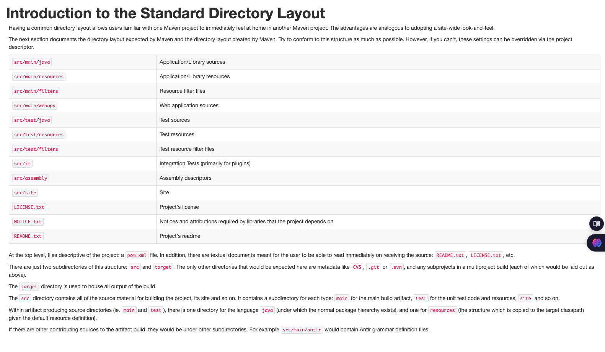

# Spring Boot Ultimate Guide - Devtiro

### What is Apache Maven?
Maven is a popular, open-source build tool that automates the process of building and developing Java-based applications. 
It's used to build, publish and deploy multiple projects at once to improve project management.
Maven automates many tasks, including: Compiling source code, Managing dependencies, Assembling binary codes into packages, Executing test scripts and Building and documenting the lifecycle framework.
Maven is based on the Project Object Model (POM), which is a file that contains information about the project, such as its description, versioning, configuration management and dependencies.
For example maven command: `./mvnw clean compile`

### Maven Concepts
* `mvnw [options] [<goal(s)] [<phase(s)>]`
* mvnw
    * clean - Removed temporary directories and files
    * default - Where the most useful goals live
    * site - Where documentation is generated.
* mvnw clean 
    * pre-clean - Hook for before cleaning
    * clean - Does the actual cleaning
    * post-clean - Hook for after cleaning

```
$ ./mvnw clean
```
* mvnw [default]
    * compile - Compiles your code into bytecode
    * test - Runs unit tests
    * package - Creates a jar or war file
    * verify - Runs checks & integration tests

```
$ ./mvnw compile
$ ./mvnw test
$ ./mvnw package
$ ./mvnw verify
```

### Maven Project Structure
* Link: https://maven.apache.org/guides/introduction/introduction-to-the-standard-directory-layout.html


### Maven Workflow
* ./mvnw compile
* ./mvnw clean test
* ./mvnw clean package
* cd target
* java -jar jar_file_name
* ./mvnw clean verify

### Maven Spring Boot Plugin
* Run spring boot project from terminal
```
$ ./mvnw spring-boot:run
```

### Spring Framework vs Spring Boot
* Spring boot is a popular framework for building java applications
* A framework is a chunk of code written on top of a language's core library to solve common problems.
* Language's Core Lib -> Spring Framework -> Spring Boot -> Your App
* Spring framework is highly configurable but it takes much efforts

### Spring Boot Architecture
The Spring Boot is built on top of the core Spring framework. It is a simplified and automated version of the spring framework. The spring boot follows a layered architecture in which each layer communicates to other layers.

Spring Boot layers:
The spring boot consists of the following four layers.
1. Presentation layer - Authentication & Json Translation
2. Business Layer - Business Logic, Validation & Authorization
3. Persistance Layer - Storage Logic
4. Database Layer - Actual Database

#### Presentation Layer
The presentation layer is the top layer of the spring boot architecture. It consists of Views. i.e., the front-end part of the application. It handles the HTTP requests and performs authentication. It is responsible for converting the JSON field's parameter to Java Objects and vice-versa. Once it performs the authentication of the request it passes it to the next layer. i.e., the business layer.


#### Business Layer
The business layer contains all the business logic. It consists of services classes. It is responsible for validation and authorization.

#### Persistance layer
The persistance layer contains all the database storage logic. It is responsible for converting business objects to the database row and vice-versa.
* Spring Data JPA -> Java Object
* Spring JDBC -> SQL
* Database Driver e.g PostgreSQL

### Modularity
Modularity in a Spring Boot application refers to the practice of breaking the application into smaller, self-contained and reusable modules. Each module typically encapsulates a specific business functionality, service or feature. By organizing code in a modular structure, the application becomes more maintainable, scalable and easier to test. It also promotes reusability and separation of concerns.

### Dependency Injection
DI means that objects do not initiate their dependencies directly. Instead they receive them from an external source. When class A uses some functionality of class B, then its said that class A has a dependency of class B. 
DI is a fundamental concept in Spring Framework that makes it possible to develop loosely couples and easily testable code.

There are three main types of dependency injection:
1. Constructor Injection
2. Setter Injection
3. Field Injection

#### Constructor Injection
This is the most recommended way to achieve DI in spring. In ensures that the dependency is not null and makes the class immutable.

```
@Service 
public class TestService
{
    private final TestRepository repository;

    @Autowired
    public TestService(TestRepository repository){
        this.repository = repository;
    }

    public void performService() {
        repository.doSomething();
    }
}
```


#### Setter Injection
Setter injection allows the dependency to be injected through a setter method. 

```
@Service
public class TestService {
    private TestRepository repository;

    @Autowired
    public void setTestRepository(TestRepository repository){
        this.repository = repository;
    }

    public void performService(){
        repository.doSomething();
    }
}
```

#### Field Injection
Field injection is the least preferred method because it makes the class less testable and harder to maintain.

```
@Service
public class TestService {
    @Autowired
    private TestRepository repository;

    public void performService(){
        repository.doSomething();
    }
}
```

### Spring Inversion of Control (IoC)
Inversion of Control (IoC) is a fundamental concept in the Spring Framework. It refers to the principle where the control of object creation and management is handed over to a framework or container, rather than being controlled by the application code itself. The term "Inversion of Control" is used because the control flow of a program is inverted, shifting from the application code to the framework.

In Spring, IoC is implemented through a design pattern known as Dependency Injection (DI). It allows developers to define dependencies between different objects and lets spring manage these dependencies at runtime.

##### Key Concepts of IoC
1. IoC Container: The Spring IoC container is responsible for managing the lifecycle, and dependencies of objects (bean) in the application. The containers creates objects, wires then together, configures them and manages their entire lifecycle based on the provided configuration.
2. Dependency Injection: DI is the process of providing the dependencies that an object needs, rather than creating them within the object itself. Spring supports multiple forms of DI

    - Constructor Injection: Dependencies are injected via the class constructor.
    - Setter injection: Dependencies are injected using setter methods.
    - Field injection: Dependencies are injected directly into class fields

##### Why use IoC
1. Loose coupling: IoC promotes loose coupling between classes, meaning objects are not tightly bound to the specific classes they depend on. Instead, dependencies are injected from the outside, making the system more modular and flexible.
2. Better testability: Since objects are not responsible for creating their dependencies, it is easier to mock those dependencies during unit testing.
3. Simplified object creation: The IoC container takes care of object creating, making it easier to manage complex object graphs in an application.

#### Example
##### Without IoC (Traditional Approach)
```
public class OrderService {
    private PaymentService paymentService;

    public OrderService() {
        this.paymentService = new PaymentService();
    }

    public void processOrder() {
        paymentService.processPayment();
    }
}

public class PaymentService {
    public void processPayment() {
        System.out.println("Processing payment.....");
    }
}
```

##### With IoC (Using spring Dependency Injection)
```
1. PaymentService.java
import org.springframework.stereotype.Service

@Service
public class PaymentService {
    public void processPayment() {
        System.out.println("Processing payment.....");
    }
}

2. OrderService.java
import org.springframework.beans.factory.annotation.Autowired;
import org.springframework.stereotype.Service

@Service
public class OrderService {
    private PaymentService paymentService;

    @Autowired
    public OrderService(PaymentService paymentService){
        this.paymentService = paymentService;
    }

    public void processOrder(){
        paymentService.processPayment();
    }
}
```

Spring Boot Application Class
```
import org.springframework.boot.SpringApplication;
import org.springframework.boot.autoconfigure.SpringBootApplication;
import org.springframework.context.ApplicationContext;

@SpringBootApplication
public class SpringIoCExampleApplication {
    public static void main(String[] args) {
        ApplicationContext context = SpringApplication.run(SpringIoCExampleApplication.class, args);
    }

    OrderService orderService = context.getBean(orderService.class);
    orderService.processOrder();
}
```

##### Spring IoC Container Type
There are two types of IoC containers in Spring:
1. BeanFactory: This is the simplest container in spring. It provides basic functionality for dependency injection. It uses lazy initialization, meaning beans are only instantiated when requested. It's lightweight but generally not recommended for complex applications.
2. ApplicationContext: This is the most commonly used container in Spring. It is a superset of BeanFactory and provides more advanced features such as event propagation, declarative mechanisms to create a bean, internationalization (i18n), etc. It supports eager and lazy loading of beans.

#### Dependency Injection Types in Spring
1. Constructor Injection:
```
@Service
public class OrderService {
    private PaymentService paymentService;

    @Autowired
    public OrderService(PaymentService paymentService){
        this.paymentService = paymentService;
    }
}
```

2. Setter Injection:
```
@Service
public class OrderService{
    private PaymentService paymentService;

    @Autowired
    public void setPaymentService(PaymentService paymentService){
        this.paymentService = paymentService;
    }
}
```

3. Field Injection:
```
@Service
public class OrderService {
    @Autowired
    private PaymentService paymentService;
}
```

##### Bean Scope & Lifecycle in IoC
Spring provides different scopes in beans:
1. Singleton(default): Only one instance of the bean is created in the IoC container;
2. Prototype: A new instance is created each time the bean is requested.
3. Reques: One instance per HTTP request 
4. Session: One instance per HTTP session

```
@Configuration
public class AppConfig {
    @Bean
    @Scope("prototype")
    public PaymentService paymentService() {
        return new PaymentService();
    }
}
```

### Beans in Spring Boot
In Spring Boot, a Bean is an object that is managed by the Spring IoC container. Beans from the backbone of a Spring Boot application, providing dependency management and ensuring that objects are correctly instantiated, configured and managed through the application's lifecycle.

##### Key Concepts of Spring beans
1. IoC
2. Dependency Injection
3. Singleton Beans: By default, spring beans are singleton scoped, meaning only one instance of the bean is created and shared across the application context.
4. Bean lifecycle: A bean in Spring Boot follows a lifecycle. It is created, dependencies are injected, it is initialized and after that it can be destroyed when no longer needed.

##### Defining Beans
1. Using @Component, @Service, @Repository, @Controller annotations: These annotations automatically registered classes as beans when component scanning is enabled.
```
@Component
public class MyBean {
    public void doSomething(){
        System.out.println("MyBean is working!");
    }
}
```
2. Using @Bean annotation: Explicitly declare a method that returns a bean and annotate it with @Bean within a @Configuration class.
```
@Configuration
public class MyConfiguration {
    @Bean 
    public MyBean myBean() {
        return new MyBean();
    }
}
```

Injecting Beans Using @Autowired
```
@Component
public class MyService {
    private MyBean myBean;

    @Autowired
    public MyService(MyBean myBean){
        this.myBean = myBean;
    }

    public void process() {
        myBean.doSomething();
    }
}
```

##### Bean Lifecycle callbacks
1. Implementing InitializingBean and DisposableBean
2. Using @PostConstruct and @PreDestroy annotations
3. Defining custom methods with initMethod and destroyMethod.

```
@Component
public class MyBean {
    @PostConstruct
    public void init() {
        System.out.println("Bean is going through init.");
    }

    public void doSomething() {
        System.out.println("Doing somtheing!");
    }

    @PreDestroy
    public void destroy() {
        System.out.println("Bean will be destroyed!");
    }
}
```

### Component Scanning
Component scanning in Spring Boot is a mechanism that automatically detects and registers beans (components) into the Spring container. This feature reduces the need for manually declaring beans in the configuration files and allows the Spring Framework to manage the lifecycle of beans.

Spring Boot uses component scanning to find classes that are annotated with specific annotations, which makes them eligible for being managed by Spring Container. When a class is detected, Spring creates a bean of that class and adds it to the ApplicationContext.

The most common annotations that makes a class eligible for component scanning include:
* @Component: Generic stereotype for any Spring-managed component.
* @Service: Specialization of @Component to indicate a service class.
* @Repository: Specialization of @Component used for DAO (Data Access Object) classes.
* @Controller: Marks a class as a web controller (used in Spring MVC)
* @RestController: A specialization of @Controller for REST APIs
* @Configuration: Marks a class as a source of bean definitions.

Steps in Component Scanning:
1. Define the Base Packages: Spring will scan the base package (and its sub-packages) for classes annotated with specific stereotypes. In Spring Boot, the main application class, which is annotated with @SpringBootApplication, triggers the component scanning by default. The annotation @SpringBootApplication is a meta-annotation that includes:
* @Configuration: Marks the class as a source of bean definitions.
* @EnableAutoConfiguration: Enables Spring Boot's auto-configuration feature.
* @ComponentScan: This annotation tells Spring to scan the base package for components.

2. Detect Classes with Stereotype Annotations: Spring Boot will look for classes annotated with @Component, @Service, @Repository, @Controller or @RestController within the base package and register them as beans in the Spring Container.

### Configuration Files
The most commonly used configuration files in Spring Boot are:
1. application.properties
2. application.yml

1. application.properties: This is the default configuration file format used in Spring Boot. It is based on key-value pairs, where each property key is followed by an equals sing(=) and its value.
Example of application.properties:
```java
# Server Configuration
server.port=8081

# Database Configuration
spring.datasource.url=jdbc:mysql://localhost:3306/mydb
spring.datasource.username=root
spring.datasource.password=secret
spring.datasource.driver-class-name=com.mysql.cj.jdbc.Driver

# Loggin Configuration
logging.level.org.springframework=DEBUG
```

2. application.yml: YAML is a more structured format and many developers prefer it because it is easier to read, especially for complex configurations.
Example fo application.yml:
```java
server:
    port: 8081

spring:
    datasource:
        url: jdbc:mysql://localhost:3306/mydb
        username: root
        password: secret
        driver-class-name: com.mysql.cj.jdbc.Driver

logging:
    level:
        prg.springframework: DEBUG
```

### Environment Variables
In a spring boot application, environment variables are used to configure application properties externally without hardcoding values in the source code or configuration files. This makes the application more flexible, secure and portable across different environments like development, staging and production.

How Environment Variables Work in Spring Boot:
1. Externalized Configuration:
* application.properties or application.yml files
* Command-line arguments
* Environment variables
* System Properties
* Profiles (for different environments like dev, prod)

2, Setting Environment Variables: Environment variables can be set at the system level, via Docker containers or in a CI/CD pipeline. They are injected into Spring Boot using a predefined naming convention or can be mapped manually.

Accessing Environment Variables in Spring Boot:
1. In application.properties or application.yml:
```
# application.properties
db.url=${DATABASE_URL}
db.username=${DATABASE_USERNAME}
db.password=${DATABASE_PASSWORD}
```

If the environment variable isn't found, can be provided a default value:
```
db.url=${DATABASE_URL:jdbc:mysql://localhost:3306/mydb}
```

2. Using @Value Annotation: Environment variables can be injected directory into spring-managed beans using the @Value annotation
```
@Value("${DATABASE_URL}")
private String databaseUrl;
```

3. Using @ConfigurationProperties: Spring Boot also allows binding environment variables to a class using @ConfigurationProperties
```
@ConfigurationProperties(prefix = "db")
public class DatabaseConfig {
    private String url;
    private String username;
    private String password;
}
```

4. Using Environment Object: The Environment object can be used to access environment variables programmatically.
```
@Autowied
private Environment env;

public void printDatabaseUrl(){
    String dbUrl = env.getProperty("DATABASE_URL");
    System.out.println(dbUrl);
}
```

### Database Layers
1. Database Driver: The database driver is the lowest layer in the database access stack. It is the communication bridge between application and actual database. This driver implements the JDBC (Java Database Connectivity) API, which allows java applications to interact with database using SQL queries.
For example: For a MySQL database, the driver is mysql-connector-java. For PostgreSQL it is postgresql. Key features are direct interaction with database, executes sql queries, updates and fetches results, converts database-specific data types into Java Types.

To add a MySQL driver in pom.xml (Maven), 
```
<dependency>
    <groupId>mysql</groupId>
    <artifactId>mysql-connector-java</artifact>
    <scope>runtime</scope>
</dependency>
```

2. Spring JDBC: Spring JDBC provides a higher-level abstraction over raw JDBC API. It simplifies working with the database by reducing boilerplate code, such as managing Connection, Statement, ResultSet, and handling exceptions.
```
@Autowired
private jdbcTemplate jdbcTemplate;

public List<User> getAllUsers() {
    String sql = "SELECT * FROM users";
    return jdbcTemplate.query(sql, (rs, rowNum) -> 
        new User(rs.getInt('id'), res.getString("name"))
    );
}
```

3. Spring Data JPA: Spring Data JPA sits on top of JPA (Java Persistence API) and is the highest level abstraction in the stack. It simplifies working with database even further by using object-relational mapping (ORM), allowing to interact with the database using java objects instead of raw sql queries. 
Spring Data JPA usually works with Hibernate, the most popular JPA implementation.
Key features are, can be defined repository interfaces without implementing any methods, and Spring Data JPA will automatically generate the required SQL queries based on method names, Java classes annotated with @Entity are mapped to database tables, allows defining custom query methods by following specific naming conventions such as findByName(), findByAgeGreaterThan() etc.

```
# Entity class
@Entity
public class User {
    @Id
    @GeneratedValue(strategy = GenerationType.INDENTITY)
    private Long id;
    private String name;
    private String email;
}

# Repository Interface
public interface UserRepository extends JpaRepository<User, Long> {
    List<User> findByName(String name);
}

# Usage
@Autowired
private UserRepository userRepository;
public List<User> getUsersByName(String name) {
    return userRepository.findByName(name);
}
```