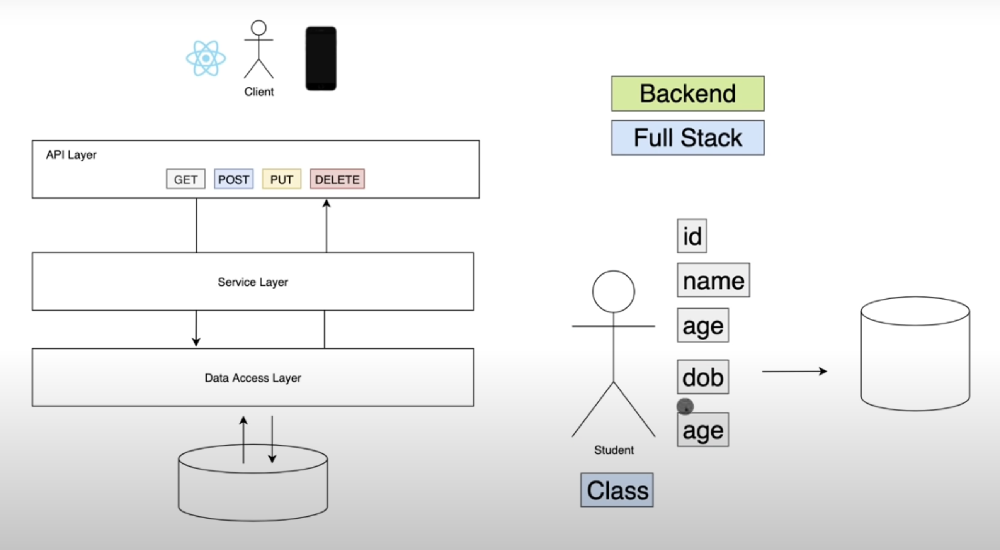

# Spring Boot Tutorial - Amigoscode

### Spring Boot Overview
Spring Boot is an open-source Java framework used for programming standalone, production-grade Spring-based applications with minimal effort. Spring Boot is a convention-over-configuration extension for the Spring Java platform intended to help minimize configuration concerns while creating Spring-based applications.

* Security
* Logging
* Metrics
* Connecting to DB
* Easy to learn
* Production ready
* Microservices
* Dependency Injection
* Configuration
* Great Community
* and more...

### Project Overview


### Spring Initializer
* https://start.spring.io/
* Project - Maven vs Gradle
Maven and Gradle are both popular build automation tools in the Java ecosystem that use parallel project building and dependency resolution. In build approach, Maven uses a fixed, linear model of phases, Gradle uses a graph of task dependencies, with tasks performing the work. In project structure, Maven follows strict conventions and project structures, Gradle uses a configuration approach that gives developers more control over the built process. In customization, Gradle is more flexible and customizable than Maven, making it better suited for large and more complex projects. In performance, Gradle is generally faster than Maven due to its mechanisms for work avoidance and incrementality.

* Project packaging - Jar vs War
In general, JAR files are preferable for deploying Spring Boot applications because they are lightweight and can be run as standalone applications without requiring an application server. However, if you want multiple applications running under the same application server, you should choose WAR.

### Project setup from Spring Initializer
* Project - Maven
* Language - Java
* Spring boot - 3.3.3
* Project Metadata as default
* Packaging - Jar
* Java - 22
* Dependencies - Spring Web, Spring Data JPA, PostgreSQL Driver

### Development Tools Setup
* Download and install JetBrains Tool Box app: https://www.jetbrains.com/toolbox-app/
* Install IntelliJ IDEA Ultimate as IDEA

### Starting the Server
* Right click on pom.xml -> maven -> reaload project
* From src -> main -> java -> com.example.demo -> DemoApplication, Run the main function to start the server

### Create Database in postgres
```angular2html
CREATE DATABASE student;
```

### Some database operation from terminal
* List of databases: \l
* List of users to access db: \du
* Provide access to database to a specific user
```angular2html
GRANT ALL PRIVILEGES ON DATABASE "student" TO postgres;
```

### @Entity
This is an entity class that is annotated with “@Entity” annotation and the table will be created with the same name as this class.

### @Table
The @Table annotation allows you to specify the details of the table that will be used to persist the entity in the database.

### @SequenceGenerator
This annotation defines a primary key generator that may be referenced by name when a generator element is specified for the GeneratedValue annotation. A sequence generator may be specified on the entity class or on the primary key field or property.

### @GeneratedValue
The @GeneratedValue annotation can be used with parameters alongside @Id to designate how an entity's unique ID value will be generated. If no parameters are provided, the ID will be generated according to the default algorithm used by the underlying database.

### Connected with database
```angular2html
\c student
```
### Describe the database
```
\d student
```